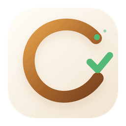
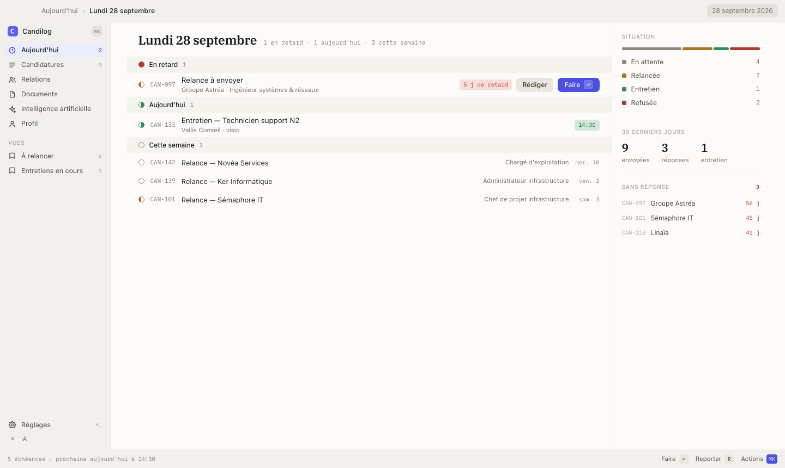
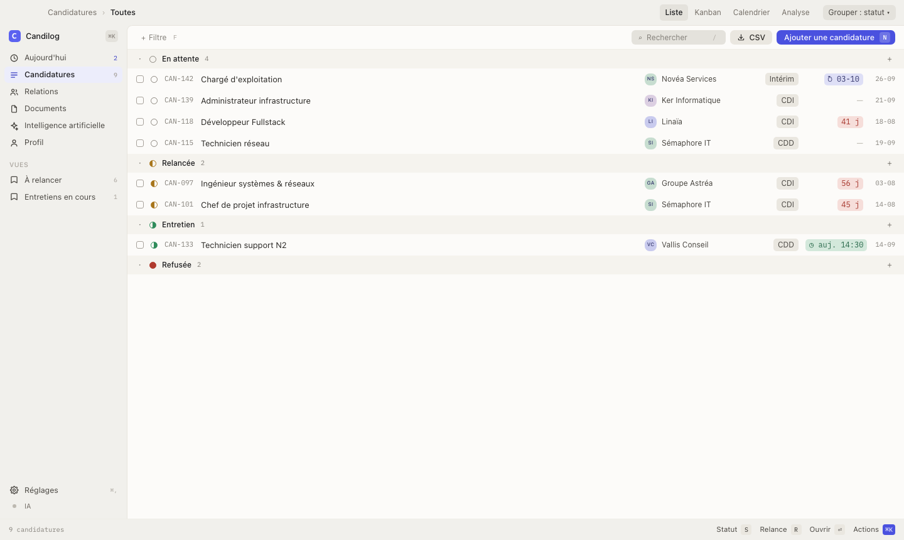
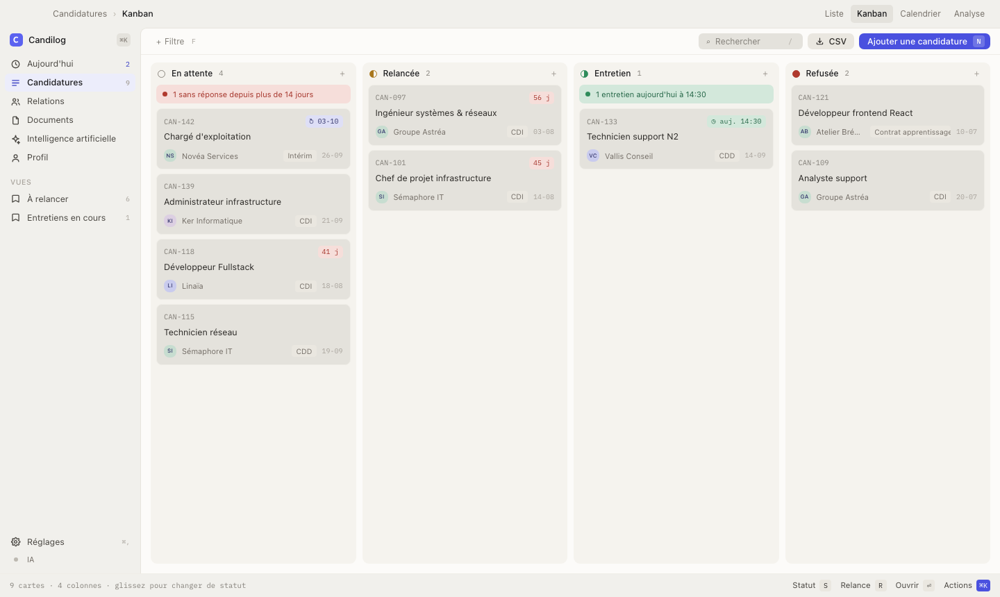
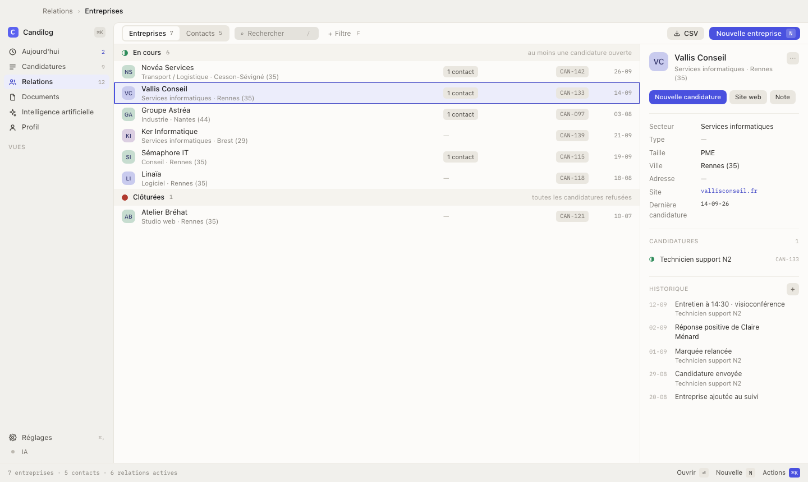
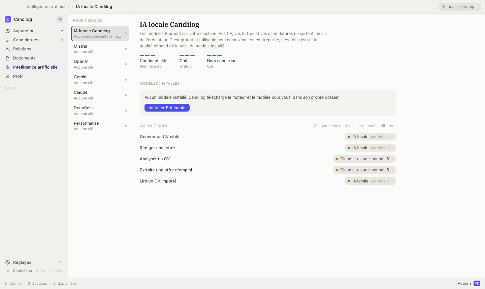
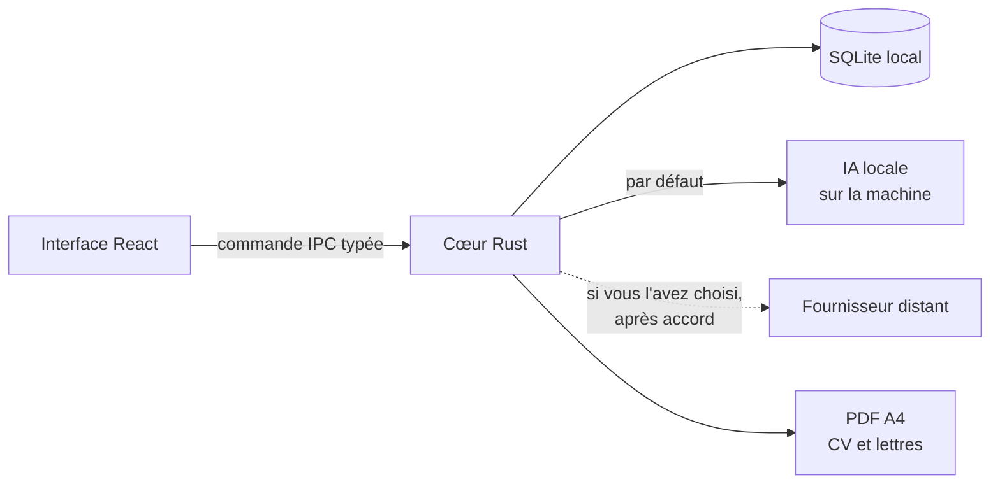

<div align="center">



# Candilog

**Le suivi de recherche d'emploi qui reste sur votre ordinateur.**

Candidatures · entreprises et contacts · relances et entretiens · CV et lettres avec l'IA

[](https://github.com/alexandrebouttierdev/candilog/releases/latest)
[](https://github.com/alexandrebouttierdev/candilog/actions/workflows/release.yml)
[](LICENSE)


[Site](https://candilog.fr) · [Fonctionnalités](#fonctionnalités) · [Télécharger](#télécharger) ·
[Vos données](#vos-données) · [Raccourcis](#raccourcis-clavier) ·
[Comment ça marche](#comment-ça-marche) · [Développer](#développer) · [Documentation](#documentation)

</div>

---

<picture>
  <source media="(prefers-color-scheme: dark)" srcset="docs/images/aujourdhui-sombre.png">
  
</picture>

Candilog rassemble toute votre recherche d'emploi dans une application de bureau : les
candidatures envoyées, les entreprises et les personnes rencontrées, les relances à faire,
les entretiens à venir, et les CV et lettres de motivation adaptés à chaque offre.

Tout est enregistré **sur votre machine**, dans une base locale. L'IA peut tourner
**entièrement hors ligne** ; si vous choisissez un service en ligne, Candilog vous demande
votre accord avant le premier envoi.

## Pourquoi Candilog

- 🔒 **Vos données restent chez vous** : pas de compte, pas de cloud, pas de télémétrie.
  Candilog n'envoie rien sans une action de votre part.
- 🧭 **Rien ne vous échappe** : l'écran *Aujourd'hui* montre les relances en retard, les
  entretiens du jour et les candidatures restées sans réponse.
- ✍️ **Des documents fidèles à votre parcours** : le CV et la lettre ne reprennent que des
  faits de votre profil ; l'IA propose, vous gardez la main.
- ⚡️ **Une vraie application de bureau** : rapide, pensée pour le clavier, palette de
  commandes, thème clair et sombre.

## Fonctionnalités

**Candidatures**
- Chaque candidature reçoit une référence lisible (`CAN-142`), un statut (en attente,
  relancée, entretien, refusée) et son canal : offre, site de l'entreprise, réseau,
  spontanée.
- Liste groupée par statut, par entreprise ou par contrat, Kanban par glisser-déposer,
  calendrier des entretiens et des relances, écran d'analyse (parcours, taux de réponse
  par canal, rythme d'envoi).
- Filtres combinables et inversables, recherche, vues enregistrées dans la navigation,
  export CSV.

**Relations**
- Entreprises et contacts réunis, rangés selon l'état de la relation : en cours, repérées,
  clôturées ; recruteurs et managers, réseau.
- Fiche avec l'historique complet (candidatures, statuts, entretiens, relances) et des
  notes datées pour ce qui se passe hors de l'application : un appel, une réponse.
- Export CSV des entreprises et des contacts.

**CV et lettres de motivation**
- Générateur de CV ciblé sur une offre : sections du profil à inclure, ton, déroulé des
  étapes en direct, score ATS et recommandations à accepter ou non.
- Rédaction de lettre avec corrections guidées et mesure de l'adéquation à l'offre.
- Analyse d'un CV face à une offre : chaque exigence est couverte, partielle ou absente,
  avec la preuve trouvée.
- Export PDF A4, bibliothèque de documents et **versions** : chaque enregistrement ajoute
  une version, et l'on peut revenir à une version précédente sans rien perdre.
- Import d'un CV PDF pour remplir votre profil.

**Intelligence artificielle**
- **IA locale Candilog** : Candilog installe lui-même le moteur et le modèle adaptés à votre
  machine. Ensuite, tout fonctionne hors connexion, sans rien installer d'autre.
- Ou le fournisseur de votre choix : Mistral, OpenAI, Gemini, Claude, DeepSeek, ou un
  point d'accès compatible. La clé API est rangée dans le trousseau du système.
- *Qui fait quoi* : chaque tâche (générer un CV, rédiger une lettre, analyser un CV, lire
  une offre, importer un CV) peut utiliser un modèle différent, local ou distant.

**Au quotidien**
- Palette de commandes (`⌘K`), navigation au clavier, raccourcis affichés dans la barre
  d'état.
- Sauvegarde et restauration de la base en un fichier, mises à jour vérifiées avant
  installation.

<table>
  <tr>
    <td width="50%"></td>
    <td width="50%"></td>
  </tr>
  <tr>
    <td align="center"><sub>Candidatures groupées par statut</sub></td>
    <td align="center"><sub>Kanban</sub></td>
  </tr>
  <tr>
    <td width="50%"></td>
    <td width="50%"></td>
  </tr>
  <tr>
    <td align="center"><sub>Relations et historique</sub></td>
    <td align="center"><sub>IA locale et « Qui fait quoi »</sub></td>
  </tr>
</table>

<sub>Captures réalisées avec des données de démonstration fictives.</sub>

## Télécharger

Choisissez votre système pour télécharger directement la dernière version de Candilog.

<div align="center">

<a href="https://github.com/alexandrebouttierdev/candilog/releases/latest/download/candilog-windows-latest.exe"></a>
<a href="https://github.com/alexandrebouttierdev/candilog/releases/latest/download/candilog-macos-latest.dmg"></a>
<a href="https://github.com/alexandrebouttierdev/candilog/releases/latest/download/candilog-ubuntu-latest.deb"></a>
<a href="https://github.com/alexandrebouttierdev/candilog/releases/latest/download/candilog-fedora-latest.rpm"></a>
<a href="https://github.com/alexandrebouttierdev/candilog/releases/latest/download/candilog-arch-latest.pkg.tar.zst"></a>

[Voir toutes les versions et les notes de publication](https://github.com/alexandrebouttierdev/candilog/releases/latest)

</div>

| Système | Fichier | Installation |
| --- | --- | --- |
| Windows 10 / 11 | `candilog-windows-latest.exe` | Double-cliquer sur l'installateur |
| macOS (Apple Silicon et Intel) | `candilog-macos-latest.dmg` | Ouvrir l'image, glisser Candilog dans *Applications* |
| Ubuntu, Debian | `candilog-ubuntu-latest.deb` | `sudo apt install ./candilog-ubuntu-latest.deb` |
| Fedora, RHEL | `candilog-fedora-latest.rpm` | `sudo dnf install ./candilog-fedora-latest.rpm` |
| Arch Linux | `candilog-arch-latest.pkg.tar.zst` | `sudo pacman -U ./candilog-arch-latest.pkg.tar.zst` |

> [!NOTE]
> Les binaires ne portent pas encore de signature de code commerciale. Au premier
> lancement, **Windows** affiche « Windows a protégé votre ordinateur » : *Informations
> complémentaires* → *Exécuter quand même*. **macOS** refuse l'ouverture : clic droit sur
> l'application → *Ouvrir*, ou *Réglages Système → Confidentialité et sécurité*.

<details>
<summary><b>Vérifier le fichier téléchargé</b></summary>

Chaque release publie `SHA256SUMS`. Placez-le à côté de l'installateur :

```bash
sha256sum -c SHA256SUMS --ignore-missing     # Linux
shasum -a 256 -c SHA256SUMS --ignore-missing # macOS
```

```powershell
Get-FileHash .\\candilog-windows-latest.exe -Algorithm SHA256   # Windows, à comparer au fichier
```

Chaque binaire porte aussi une **attestation de provenance** [Sigstore](https://www.sigstore.dev/),
qui prouve qu'il a été construit par ce dépôt et son workflow de release :

```bash
gh attestation verify candilog-ubuntu-latest.deb --repo alexandrebouttierdev/candilog
```

| Garantie | Ce qu'elle prouve | Ce qu'elle ne prouve pas |
| --- | --- | --- |
| `SHA256SUMS` | Le fichier est arrivé intact | Son origine |
| Attestation de provenance | Construit par ce dépôt, ce commit, ce workflow | Rien pour SmartScreen ni Gatekeeper |
| Signature de code | *(pas encore)* | — |

</details>

**Mises à jour** : Candilog ne cherche jamais de mise à jour tout seul. *Réglages → Mises à
jour → Rechercher maintenant* télécharge l'installateur, vérifie son empreinte SHA-256, puis
vous laisse l'installer.

## Vos données

Tout vit sur votre machine. Candilog ne contacte Internet que dans trois cas, toujours à
votre demande : la recherche de mise à jour, un appel au fournisseur IA distant que vous
avez configuré, et le téléchargement d'un modèle d'IA locale. Ni télémétrie, ni statistiques
d'usage, ni rapport d'erreur automatique.

| Quoi | Où |
| --- | --- |
| Base, journaux | Linux `~/.local/share/fr.candilog.desktop/` · Windows `%APPDATA%\fr.candilog.desktop\` · macOS `~/Library/Application Support/fr.candilog.desktop/` |
| Modèles de l'IA locale | Sous-dossier `ai/models/` du dossier ci-dessus (0,5 à 8,2 Go selon le modèle), supprimables depuis *Réglages → IA* |
| Clé API d'un fournisseur | Trousseau du système, jamais dans la base ni dans les journaux |
| CV, lettres, sauvegardes, CSV | Là où vous choisissez de les enregistrer |

Avec un fournisseur **distant**, seuls partent le texte de l'offre et les éléments du profil
nécessaires à la tâche, après votre accord au premier envoi. Avec l'**IA locale**, rien ne
quitte la machine.

*Réglages → Données* exporte toute la base en un fichier et peut tout effacer. Désinstaller
l'application ne supprime ni le dossier de données ni l'entrée du trousseau.

## Raccourcis clavier

| Raccourci | Action | Raccourci | Action |
| --- | --- | --- | --- |
| `⌘K` | Palette de commandes | `⌘,` | Réglages |
| `G` puis `A` `C` `R` `D` `P` | Aujourd'hui, Candidatures, Relations, Documents, Profil | `/` | Rechercher |
| `N` | Nouvelle candidature, fiche ou CV | `F` | Ajouter un filtre |
| `S` | Changer le statut | `R` | Programmer une relance |
| `⌘D` | Dupliquer | `⌘E` | Exporter en PDF |
| `⌘S` | Enregistrer | `⌘⏎` | Valider un formulaire |
| `⌘.` | Arrêter une génération | `⏎` | Ouvrir la sélection |

Sous Windows et Linux, `⌘` correspond à `Ctrl`. La barre d'état rappelle les raccourcis de
l'écran affiché.

## Comment ça marche



- **Interface** : React 19 et TypeScript, organisée par fonctionnalité
  (`vue → ViewModel → service`) ; tous les appels au cœur passent par un seul module IPC.
- **Cœur** : Rust, architecture hexagonale (`domain · application · infrastructure ·
  presentation`) ; le domaine ne dépend ni de Tauri ni de SQLite.
- **Contrat** : les types TypeScript échangés sont générés depuis Rust (`ts-rs`) ; chaque
  entrée est revalidée côté Rust.
- **Données** : SQLite embarqué, schéma versionné par migrations additives.

Détails dans [`docs/ARCHITECTURE.md`](docs/ARCHITECTURE.md).

## Développer

**Prérequis** : Node.js LTS avec Yarn (`corepack enable`), Rust 1.91 et les
[dépendances système de Tauri 2](https://v2.tauri.app/start/prerequisites/).

```bash
git clone https://github.com/alexandrebouttierdev/candilog.git
cd candilog
yarn install
yarn tauri dev     # application complète, fenêtre native
```

`yarn dev` sert l'interface seule sur `http://localhost:1420`, sans le cœur Rust. En
développement, la base vit dans `src-tauri/.candilog-dev/` et ne touche jamais vos vraies
données.

<details>
<summary><b>Validations avant de proposer un changement</b></summary>

```bash
yarn lint
yarn test
yarn build            # inclut tsc --noEmit

cargo fmt --manifest-path src-tauri/Cargo.toml --all -- --check
cargo clippy --manifest-path src-tauri/Cargo.toml --locked --all-targets -- -D warnings
cargo test --manifest-path src-tauri/Cargo.toml --locked --all-targets
```

Le workflow de release rejoue ces contrôles et bloque la publication au premier échec.

</details>

```
src/                  interface React (features/<domaine>/{model,view,viewmodel,services})
src-tauri/src/        cœur Rust (app, core, features/<domaine>/…, infrastructure/pdf)
src-tauri/migrations/ schéma SQLite
website/              site candilog.fr (Next.js, projet autonome)
docs/                 documentation de référence
```

## Documentation

| Document | Sujet |
| --- | --- |
| [`docs/ARCHITECTURE.md`](docs/ARCHITECTURE.md) | Couches et frontières |
| [`docs/CODE_RULES.md`](docs/CODE_RULES.md) | Conventions, tests, sécurité |
| [`docs/DESIGN.md`](docs/DESIGN.md) | Design system |
| [`docs/DATA.md`](docs/DATA.md) | Schéma SQLite et chemins de données |
| [`docs/AI.md`](docs/AI.md) | Fournisseurs IA, streaming, annulation |
| [`docs/DEVELOPMENT.md`](docs/DEVELOPMENT.md) | Installation, exécution, validations |
| [`docs/RELEASES.md`](docs/RELEASES.md) | Publication des binaires |
| [`CHANGELOG.md`](CHANGELOG.md) | Journal des versions |

Les agents IA (Codex, Cursor, Claude Code…) suivent [`AGENTS.md`](AGENTS.md), avec des
règles propres à [`src/`](src/AGENTS.md), [`src-tauri/`](src-tauri/AGENTS.md) et
[`website/`](website/AGENTS.md).

## Contribuer

Les contributions sont les bienvenues : lisez [`CONTRIBUTING.md`](CONTRIBUTING.md) et, lorsqu'il
est requis, le [`CLA.md`](CLA.md). Idées et retours dans les
[issues](https://github.com/alexandrebouttierdev/candilog/issues).

Une faille de sécurité ? Signalez-la en privé, sans issue publique : voir
[`SECURITY.md`](SECURITY.md).

## Licence

Candilog est **source available**, sous double licence :

- **Usage non commercial** : [PolyForm Noncommercial License 1.0.0](LICENSE), dont le texte
  officiel fait foi.
- **Usage commercial** : licence séparée, accordée explicitement par le titulaire des droits
  (voir [`COMMERCIAL_LICENSE.md`](COMMERCIAL_LICENSE.md)).

Candilog embarque les polices IBM Plex (SIL Open Font License) ; les composants tiers sont
attribués dans [`THIRD_PARTY_NOTICES.md`](THIRD_PARTY_NOTICES.md) et les licences des
dépendances dans [`LICENSES.md`](LICENSES.md). Les noms des fournisseurs d'IA cités sont
des marques de leurs propriétaires ; Candilog n'y est pas affilié.

© 2026 Alexandre Bouttier
